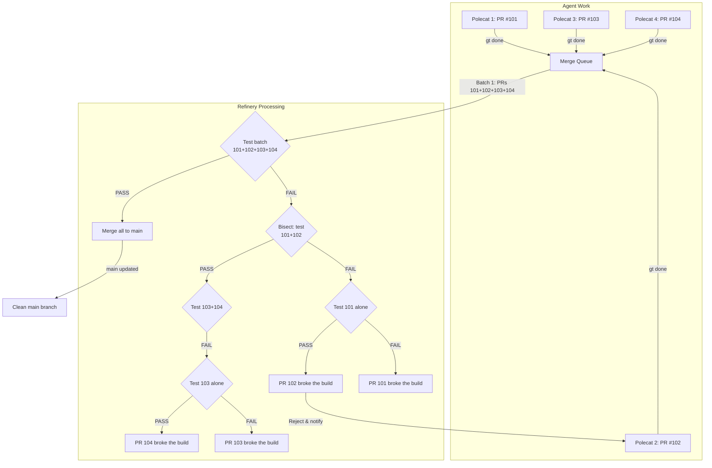

# Learning Gas Town & Beads

A deep dive into [Gas Town](https://github.com/gastownhall/gastown) and [Beads](https://github.com/gastownhall/beads) — Steve Yegge's multi-agent orchestration framework and its companion distributed issue tracker.

This repo documents what I learned by exploring the codebases, reading the source, and building them from scratch.

---

## What is Gas Town?

Gas Town is an **orchestration framework for AI coding agents**. It coordinates 4-30+ AI agents (Claude Code, Codex, Copilot, Gemini, Cursor, etc.) working simultaneously on a codebase. Think of it as a "city government" for your AI workforce.

**The problem it solves:** When multiple AI agents work on the same repo, you get context loss on restart, merge chaos, no coordination, and information overload. Gas Town fixes all of that.

**Key stats (as of April 2026):**
- 13,458 GitHub stars
- Written in Go (~12.3M lines)
- MIT licensed
- v1.0.0 released April 3, 2026

## What is Beads?

Beads (`bd`) is a **distributed graph issue tracker for AI coding agents**, powered by [Dolt](https://github.com/dolthub/dolt) (a version-controlled SQL database). Its tagline: *"A memory upgrade for your coding agent."*

Where Git captures the What, Where, Who, and How — Beads captures **the Why**. It gives agents persistent, structured memory so they can handle long-horizon tasks without losing context.

**Key stats:**
- 20,177 GitHub stars
- Also Go, also MIT licensed
- v1.0.0 released same day as Gas Town

---

## The Journey from "Clown Show" to v1.0

Steve Yegge's [blog post](https://steve-yegge.medium.com/gas-town-from-clown-show-to-v1-0-c239d9a407ec) describes a rough first three months:

- Workers crashing mid-job ("serial killer sprees")
- Data loss incidents ("22-nose Clown Show")
- The **Deacon** (a cross-rig background supervisor) was the recurring culprit

All resolved by v1.0 — the system now runs stably for weeks.

---

## Gas Town Architecture

### The Cast of Characters

Gas Town uses a rich domain vocabulary. Here's the hierarchy:

| Concept | What it does |
|---------|-------------|
| **Mayor** | Primary AI coordinator — your personal concierge. Reads all worker output and surfaces only what matters |
| **Town** | Workspace root directory (e.g., `~/gt/`) |
| **Rigs** | Project containers, each wrapping a git repo |
| **Crew** | Human workspace within a rig |
| **Polecats** | Worker AI agents with persistent identity but ephemeral sessions |
| **Hooks** | Git worktree-based persistent storage for agent work |
| **Convoys** | Work tracking units bundling multiple beads |
| **Witness** | Per-rig lifecycle manager monitoring polecats |
| **Deacon** | Cross-rig background supervisor running patrol cycles |
| **Dogs** | Infrastructure workers for maintenance tasks |
| **Refinery** | Per-rig Bors-style bisecting merge queue (see diagram below) |
| **Seance** | Session discovery/continuation via `.events.jsonl` logs |
| **Wasteland** | Federated work coordination network linking Gas Towns via DoltHub |
| **Scheduler** | Config-driven capacity governor preventing API rate limit exhaustion |

### Monitoring Hierarchy

```
Daemon (Go process)
  └── Boot (AI agent)
       └── Deacon (AI agent)
            ├── Witnesses (per-rig)
            └── Refineries (per-rig)
```

### The Refinery: Bors-Style Bisecting Merge Queue

Agents never push directly to `main`. Instead, the **Refinery** batches completed work and tests it before merging. If a batch fails, it bisects to find the broken PR — just like [Bors](https://bors.tech/).



**Why this matters with 30 agents:** Without a merge queue, agents would constantly break each other's work. The Refinery guarantees that `main` is always green. When a batch fails, bisecting pinpoints exactly which PR is the culprit — no human investigation needed.

### Workflow Primitives

- **Formulas** — TOML-defined workflow templates for multi-step processes
- **Molecules** — Epics with children defining dependency-aware execution graphs. Children are parallel by default; explicit `blocks` dependencies create sequencing.

---

## Beads Architecture

### Two-Layer Data Model

1. **CLI Layer** — Cobra-based Go CLI (`cmd/bd/`) with commands like `bd create`, `bd ready`, `bd update`, `bd close`, `bd dep add`, `bd sync`
2. **Dolt Database Layer** — Version-controlled SQL database in `.beads/dolt/`. Every write auto-commits to Dolt, creating an immutable audit trail.

### Storage Modes

| Mode | Description | Use Case |
|------|-------------|----------|
| **Embedded** (default) | Dolt runs in-process, no server needed. Single-writer, file-lock enforced. | Solo agent, simple setups |
| **Server** | Connects to external `dolt sql-server` on port 3307. Multi-writer capable. | Gas Town multi-agent orchestration |

### Key Design Decisions

- **Hash-based IDs** (`bd-a1b2`) instead of sequential IDs — prevents merge collisions when multiple agents create issues concurrently
- **Event-driven FlushManager** with single-owner pattern — channels instead of mutexes eliminates race conditions
- **Cell-level merge** (via Dolt) — two agents can update different fields of the same issue without conflict
- **Dolt branching** is independent of git branches, enabling isolated workstreams

#### Example: Why Sequential IDs Break with Multiple Agents

Imagine 3 agents working in parallel on different git branches:

```
Agent A (branch: feature-auth)     creates issue #42
Agent B (branch: feature-api)      creates issue #42  ← COLLISION!
Agent C (branch: feature-ui)       creates issue #42  ← COLLISION!
```

With sequential IDs, each agent's local counter independently reaches `#42`. When branches merge, you get three different issues all claiming to be `#42`. Which one wins? Data loss.

Beads solves this with **hash-based IDs** derived from content + timestamp + agent identity:

```
Agent A → bd-f7a3   (hash of "auth task" + timestamp + agent-A-identity)
Agent B → bd-c91e   (hash of "api task"  + timestamp + agent-B-identity)
Agent C → bd-2d5b   (hash of "ui task"   + timestamp + agent-C-identity)
```

Every ID is globally unique. Branches merge cleanly. No coordination needed between agents.

#### Example: Cell-Level Merge vs Line-Level Merge

Traditional git uses **line-level merge**. If two people edit the same line, you get a conflict — even if they changed different parts of the line.

Dolt uses **cell-level merge**, like a spreadsheet. Each field in a row is an independent cell:

```
Issue bd-f7a3 in the beads database:

           title          status       assignee
           ─────          ──────       ────────
Original:  "Fix auth"     "pending"    "unassigned"
Agent A:   "Fix auth"     "active"     "unassigned"   ← changed status
Agent B:   "Fix auth"     "pending"    "polecat-7"    ← changed assignee
```

With **line-level merge** (git): CONFLICT — both agents touched the same row.

With **cell-level merge** (Dolt): No conflict! Agent A changed `status`, Agent B changed `assignee`. Different cells. Dolt merges both automatically:

```
Merged:    "Fix auth"     "active"     "polecat-7"    ✓ Both changes preserved
```

This is critical when 30 agents are updating issue statuses, adding comments, and reassigning work simultaneously. Line-level merge would create constant conflicts. Cell-level merge just works.

### Integrations

- Claude Code plugin (`integrations/claude-code/`)
- MCP Server (`integrations/beads-mcp/`, published on PyPI)
- JetBrains Junie (`integrations/junie/`)
- GitHub Issues, GitLab, Jira, Linear, Notion import/sync

---

## Repo Structure: Gas Town

```
gastown/
├── cmd/
│   ├── gt/                  # Main CLI binary
│   ├── gt-proxy-server/     # Proxy server
│   └── gt-proxy-client/     # Proxy client
├── internal/                # 70+ Go packages
│   ├── mayor/               # Mayor orchestration
│   ├── polecat/             # Worker agent management
│   ├── deacon/              # Background supervisor
│   ├── witness/             # Per-rig lifecycle
│   ├── refinery/            # Merge queue
│   ├── beads/               # Beads integration
│   ├── convoy/              # Work tracking
│   ├── formula/             # Workflow templates
│   ├── hooks/               # Git worktree hooks
│   ├── scheduler/           # Capacity management
│   ├── wasteland/           # Federation
│   ├── tui/                 # Terminal UI (Bubbletea)
│   └── ...                  # 50+ more packages
├── plugins/                 # 14 built-in plugins
│   ├── compactor-dog/
│   ├── dolt-archive/
│   ├── github-sheriff/
│   ├── rate-limit-watchdog/
│   ├── stuck-agent-dog/
│   └── ...
├── templates/               # Role instruction templates
├── docs/                    # Extensive documentation
├── scripts/                 # Build/release scripts
├── npm-package/             # npm distribution wrapper
└── gt-model-eval/           # Model evaluation tooling
```

## Repo Structure: Beads

```
beads/
├── cmd/bd/                  # CLI entry point
├── internal/
│   ├── storage/             # Dolt backend
│   ├── beads/               # Core domain
│   ├── idgen/               # Hash-based ID generation
│   ├── molecules/           # Workflow graphs
│   ├── compact/             # Semantic memory decay/summarization
│   ├── git/                 # Git integration
│   ├── query/               # SQL query layer
│   ├── routing/             # Multi-repo routing
│   ├── github/              # GitHub Issues sync
│   ├── gitlab/              # GitLab sync
│   ├── jira/                # Jira sync
│   ├── linear/              # Linear sync
│   ├── notion/              # Notion sync
│   ├── ui/                  # TUI (Charm libraries)
│   └── telemetry/           # OpenTelemetry
├── integrations/
│   ├── claude-code/         # Claude Code plugin
│   ├── beads-mcp/           # MCP server (Python)
│   └── junie/               # JetBrains integration
└── docs/
    ├── ARCHITECTURE.md
    ├── DOLT.md
    ├── INTERNALS.md
    ├── MOLECULES.md
    └── FAQ.md
```

---

## How to Build Gas Town

### Prerequisites

- Go 1.25+
- Git 2.25+ (worktree support required)
- Dolt 1.82.4+
- Beads (`bd`) 0.55.4+
- sqlite3
- tmux 3.0+ (recommended)
- At least one AI agent CLI (Claude Code, Codex, Copilot, etc.)

### Build from Source

```bash
git clone https://github.com/gastownhall/gastown.git
cd gastown

# Build all binaries (gt, gt-proxy-server, gt-proxy-client)
make build

# Install to ~/.local/bin with version info baked in
make install

# Run tests
make test

# Or build manually without make
go build -o gt ./cmd/gt
```

### Docker

```bash
docker compose build && docker compose up -d
docker compose exec gastown zsh
gt up
```

### Package Managers

```bash
brew install gastown
# or
npm install -g @gastown/gt
```

## How to Build Beads

### Prerequisites

- Go 1.25+
- CGO enabled (`CGO_ENABLED=1`) — embedded Dolt links C libraries
- macOS: `xcode-select --install && brew install icu4c`
- Ubuntu: `sudo apt install build-essential`

### Build from Source

```bash
git clone https://github.com/gastownhall/beads.git
cd beads

# Build (produces ./bd binary, codesigns on macOS)
make build

# Install to ~/.local/bin
make install

# Run tests
make test
```

### Package Managers

```bash
brew install beads
# or
npm install -g @beads/bd
# or
go install github.com/steveyegge/beads/cmd/bd@latest
```

---

## Design Philosophy

Two principles from Gas Town's `CONTRIBUTING.md`:

### 1. Zero Framework Cognition (ZFC)

Go code handles **transport** — tmux sessions, message delivery, hooks, nudges, file I/O, observability. All **reasoning and decision-making** happens in AI agents via formulas and role templates. No hardcoded thresholds or heuristics in Go.

### 2. Bitter Lesson Alignment

Bet on models getting smarter rather than building elaborate hand-crafted heuristics. Expose data for agents to reason about rather than encoding the reasoning.

> "By the end of 2026, people will be mostly programming by talking to a face." — Steve Yegge

---

## Key Dependencies

### Gas Town
- `spf13/cobra` — CLI framework
- `charmbracelet/bubbletea` + `bubbles` + `lipgloss` + `glamour` — TUI
- `steveyegge/beads` — Core dependency
- `BurntSushi/toml` — Formula parsing
- `go-rod/rod` — Browser automation
- `go-sql-driver/mysql` — Dolt SQL connectivity
- OpenTelemetry stack — Observability
- `testcontainers-go` — Integration testing

### Beads
- `dolthub/dolt` — Version-controlled SQL database (embedded)
- `spf13/cobra` — CLI
- Charm libraries — TUI
- OpenTelemetry — Observability

---

## What I Found Most Interesting

1. **The Mayor abstraction** — Instead of reading raw agent output, the Mayor filters and presents only what matters. It's like having a project manager between you and 30 agents.

2. **Hash-based bead IDs** — Simple but brilliant. Sequential IDs break when multiple agents create issues concurrently across branches. Hash-based IDs (`bd-a1b2`) just work.

3. **Dolt as a database** — Using a version-controlled SQL database means every issue change has a full audit trail. Cell-level merge (not line-level) makes concurrent agent writes safe.

4. **The Refinery** — A Bors-style bisecting merge queue means agents never push directly to main. This prevents the merge chaos that would otherwise be inevitable with 30 agents.

5. **Zero Framework Cognition** — The Go code is deliberately "dumb" — it handles plumbing, not thinking. All intelligence lives in the AI agents themselves. This is a bet that models will keep getting smarter, so don't bake in today's heuristics.

6. **Wasteland federation** — Gas Towns can federate work across organizations via DoltHub. This is infrastructure for a future where AI agents collaborate across company boundaries.

---

## Resources

- [Gas Town repo](https://github.com/gastownhall/gastown)
- [Beads repo](https://github.com/gastownhall/beads)
- [Steve Yegge's blog post: "Gas Town: From Clown Show to v1.0"](https://steve-yegge.medium.com/gas-town-from-clown-show-to-v1-0-c239d9a407ec)
- [Gas Town glossary](https://github.com/gastownhall/gastown/blob/main/docs/glossary.md)
- [Beads architecture docs](https://github.com/gastownhall/beads/blob/main/docs/ARCHITECTURE.md)
- [Gas City](https://github.com/gastownhall/gascity) — The successor framework (alpha)
